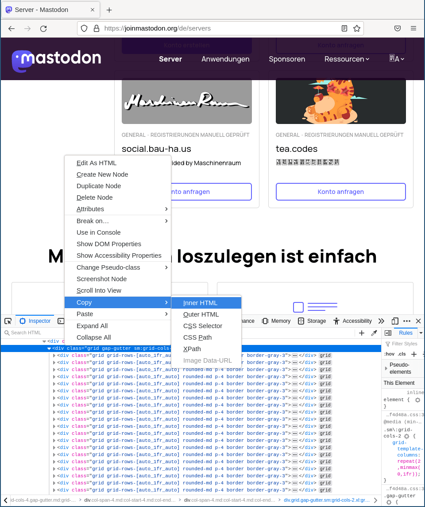

# mastodon-servers-and-versions

This repo is meant to show you that you need to make a well-reasoned decision about the Mastodon instance of your choice. Even some of the instances recommended on [joinmastodon.org](https://joinmastodon.org/servers) are quite outdated and most likely vulnerable. The oldest instance runs with a version released on July 7th 2020.

1. First scroll down to the bottom of the site [https://joinmastodon.org/servers](https://joinmastodon.org/servers). In the following example, I use the [German site](https://joinmastodon.org/de/servers), because it lists more instances.

2. Copy the "\<div\>" that contains the server list:



2. Save the clipboard to a file, e.g. "instances.txt".

3. Extract the relevant info:

```shell
❯ bash instances-and-versions.sh
You need to pass one input file, e.g.:
$ bash instances-and-versions.sh instances.txt

❯ bash instances-and-versions.sh instances.txt
{
  "sociale.network": "3.1.5",
  "computerfairi.es": "3.2.0+glitch",
  "vocalodon.net": "3.3.2",
  "mastodon.bida.im": "3.4.1",
  "fedibird.com": "3.4.1",
  "bologna.one": "3.4.5",
  "social.politicaconciencia.org": "3.4.6",
  "mstdn.jp": "3.5.1",
  "tea.codes": "3.5.1",
  "mastodonners.nl": "3.5.3",
  "uiuxdev.social": "3.5.3",
  "learningdisability.social": "3.5.3",
  "social.diva.exchange": "3.5.3",
  "social.dev-wiki.de": "3.5.3+glitch",
  "mast.dragon-fly.club": "3.5.3~island",
  "wxw.moe": "3.5.3~wxw",
  "mastodon.se": "3.5.5",
  "colorid.es": "3.5.5",
  "m.cmx.im": "3.5.5",
  "mastodonapp.uk": "3.5.5",
  "mastodon.pirateparty.be": "4.0.0rc2+glitch",
  "fulda.social": "4.0.1",
  "glasgow.social": "4.0.1",
  "hispagatos.space": "4.0.2",
  "oslo.town": "4.0.2",
  "ludosphere.fr": "4.0.2",
  "kurry.social": "4.0.2",
  "mastodon.arch-linux.cz": "4.0.2",
  "mastodon.com.py": "4.0.2",
  "federated.press": "4.0.2",
  "creators.social": "4.0.2",
  "mastodon.be": "4.0.2",
  "snabelen.no": "4.0.2",
  "dizl.de": "4.0.2",
  "mastodon.vlaanderen": "4.0.2",
  "mastodon.ml": "4.0.2",
  "kfem.cat": "4.0.2",
  "occitania.social": "4.0.2",
  "cloud-native.social": "4.0.2",
  "rheinneckar.social": "4.0.2",
  "mastodon.free-solutions.org": "4.0.2",
  "corteximplant.com": "4.0.2",
  "maly.io": "4.0.2",
  "dresden.network": "4.0.2",
  "epicure.social": "4.0.2",
  "phpc.social": "4.0.2",
  "tyrol.social": "4.0.2",
  "toot.aquilenet.fr": "4.0.2",
  "tubyte.xyz": "4.0.2",
  "seo.chat": "4.0.2",
  "mastodon.zaclys.com": "4.0.2",
  "ruby.social": "4.0.2",
  "freiburg.social": "4.0.2",
  "discuss.systems": "4.0.2",
  "rollenspiel.social": "4.0.2",
  "mastodon.mnetwork.co.kr": "4.0.2",
  "libretooth.gr": "4.0.2",
  "darmstadt.social": "4.0.2",
  "livellosegreto.it": "4.0.2",
  "muenster.im": "4.0.2",
  "machteburch.social": "4.0.2",
  "mastodon.eus": "4.0.2",
  "khiar.net": "4.0.2",
  "pettingzoo.co": "4.0.2",
  "hostux.social": "4.0.2",
  "disabled.social": "4.0.2",
  "lewacki.space": "4.0.2",
  "mastodon-belgium.be": "4.0.2",
  "toot.kif.rocks": "4.0.2",
  "primarycare.app": "4.0.2",
  "dju.social": "4.0.2",
  "x0r.be": "4.0.2",
  "pewtix.com": "4.0.2",
  "stereodon.social": "4.0.2",
  "h4.io": "4.0.2",
  "awscommunity.social": "4.0.2",
  "lor.sh": "4.0.2",
  "mastodontti.fi": "4.0.2",
  "mastodon.bachgau.social": "4.0.2",
  "urbanists.social": "4.0.2",
  "noc.social": "4.0.2",
  "ruhr.social": "4.0.2",
  "augsburg.social": "4.0.2",
  "masto.nobigtech.es": "4.0.2",
  "mastodont.cat": "4.0.2",
  "indieweb.social": "4.0.2",
  "social.anoxinon.de": "4.0.2",
  "ieji.de": "4.0.2",
  "feuerwehr.social": "4.0.2",
  "nwb.social": "4.0.2",
  "mastodon.iriseden.eu": "4.0.2",
  "pol.social": "4.0.2",
  "masto.es": "4.0.2",
  "social.cologne": "4.0.2",
  "theblower.au": "4.0.2",
  "muenchen.social": "4.0.2",
  "hessen.social": "4.0.2",
  "mathstodon.xyz": "4.0.2",
  "toot.wales": "4.0.2",
  "ravenation.club": "4.0.2",
  "sself.co": "4.0.2",
  "puntarella.party": "4.0.2",
  "masto.pt": "4.0.2",
  "union.place": "4.0.2",
  "o3o.ca": "4.0.2",
  "mastodon.nz": "4.0.2",
  "sueden.social": "4.0.2",
  "mastodon.iow.social": "4.0.2",
  "nerdculture.de": "4.0.2",
  "social.vivaldi.net": "4.0.2",
  "norden.social": "4.0.2",
  "newsie.social": "4.0.2",
  "mastodontech.de": "4.0.2",
  "mastodon.ie": "4.0.2",
  "fikaverse.club": "4.0.2",
  "mastodon.nu": "4.0.2",
  "travelpandas.fr": "4.0.2",
  "mindly.social": "4.0.2",
  "mastouille.fr": "4.0.2",
  "nrw.social": "4.0.2",
  "ioc.exchange": "4.0.2",
  "toot.community": "4.0.2",
  "mastodon.au": "4.0.2",
  "mastodon.nl": "4.0.2",
  "kolektiva.social": "4.0.2",
  "piaille.fr": "4.0.2",
  "sfba.social": "4.0.2",
  "ohai.social": "4.0.2",
  "fosstodon.org": "4.0.2",
  "mastodon.scot": "4.0.2",
  "tkz.one": "4.0.2",
  "home.social": "4.0.2",
  "hachyderm.io": "4.0.2",
  "mastodon.sdf.org": "4.0.2",
  "mstdn.party": "4.0.2",
  "mastodon.uno": "4.0.2",
  "techhub.social": "4.0.2",
  "mastodon.top": "4.0.2",
  "masto.ai": "4.0.2",
  "mstdn.social": "4.0.2",
  "universeodon.com": "4.0.2",
  "mas.to": "4.0.2",
  "mastodon.world": "4.0.2",
  "social.bau-ha.us": "4.0.2",
  "tilde.zone": "4.0.2+glitch",
  "qdon.space": "4.0.2+glitch",
  "toot.funami.tech": "4.0.2+glitch",
  "mstdn.ca": "4.0.2+glitch",
  "toot.site": "4.0.2+glitch",
  "uri.life": "4.0.2+uri1.17"
}
```
